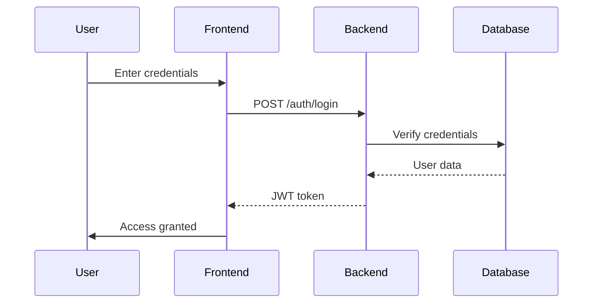
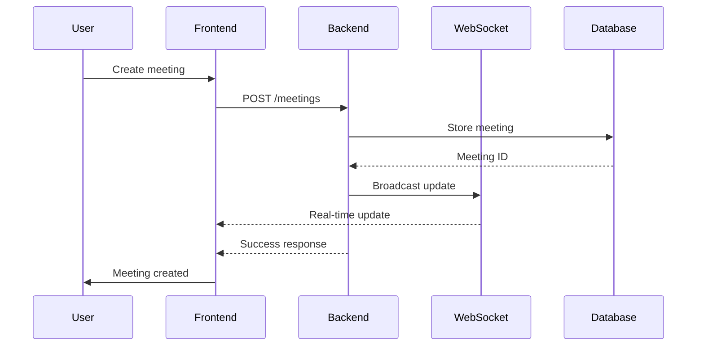

# System Architecture Overview

## System Components

### 1. Frontend Application (Next.js)
- **User Interface Layer**
  - React components
  - State management (React Context/Redux)
  - Form handling and validation
  - API integration layer
  - WebSocket client

- **Features**
  - Meeting management
  - User authentication
  - Real-time updates
  - Responsive design
  - Error handling

### 2. Backend Services (Flask)
- **API Layer**
  - RESTful endpoints
  - Authentication middleware
  - Request validation
  - Response formatting
  - Error handling

- **Business Logic Layer**
  - Meeting management
  - User management
  - Notification system
  - Data validation
  - Business rules enforcement

- **Data Access Layer**
  - SQLAlchemy ORM
  - Database migrations
  - Query optimization
  - Connection pooling

### 3. Database (PostgreSQL)
- **Data Storage**
  - User data
  - Meeting information
  - Authentication records
  - System configurations

- **Features**
  - ACID compliance
  - Transaction management
  - Data integrity
  - Indexing
  - Backup and recovery

### 4. WebSocket Server
- **Real-time Features**
  - Meeting updates
  - User presence
  - Notifications
  - Chat functionality

## System Interactions

### 1. Authentication Flow

### 2. Meeting Creation Flow

## Security Architecture

### 1. Authentication
- JWT-based authentication
- Token refresh mechanism
- Role-based access control
- Session management

### 2. Data Security
- HTTPS/TLS encryption
- Password hashing
- Input sanitization
- XSS prevention
- CSRF protection

### 3. API Security
- Rate limiting
- Request validation
- Error handling
- Audit logging
- IP blocking

## Performance Considerations

### 1. Frontend
- Code splitting
- Lazy loading
- Caching strategies
- Bundle optimization
- Image optimization

### 2. Backend
- Connection pooling
- Query optimization
- Caching layer
- Async operations
- Load balancing

### 3. Database
- Indexing strategy
- Query optimization
- Connection pooling
- Partitioning
- Replication

## Deployment Architecture

### 1. Development Environment
- Local development setup
- Development database
- Mock services
- Hot reloading

### 2. Staging Environment
- Kubernetes cluster
- Staging database
- Integration testing
- Performance testing

### 3. Production Environment
- High availability setup
- Load balancing
- Database replication
- Monitoring
- Logging

## Monitoring and Logging

### 1. Application Monitoring
- Performance metrics
- Error tracking
- User analytics
- System health
- API metrics

### 2. Logging Strategy
- Application logs
- Access logs
- Error logs
- Audit logs
- Performance logs

## Future Considerations

### 1. Scalability
- Horizontal scaling
- Vertical scaling
- Database sharding
- Caching strategy
- Load distribution

### 2. Maintainability
- Code organization
- Documentation
- Testing strategy
- Deployment automation
- Monitoring tools

### 3. Extensibility
- Plugin architecture
- API versioning
- Feature flags
- Configuration management
- Service integration

## Next Steps

1. Review detailed documentation:
   - [Backend Architecture](./backend-architecture.md)
   - [Frontend Architecture](./frontend-architecture.md)
   - [Database Design](../database/1-schema-design.md)

2. Explore implementation guides:
   - [Backend Development](../backend/1-basic-concepts.md)
   - [Frontend Development](../frontend/1-react-basics.md)
   - [Database Management](../database/2-data-migration.md) 